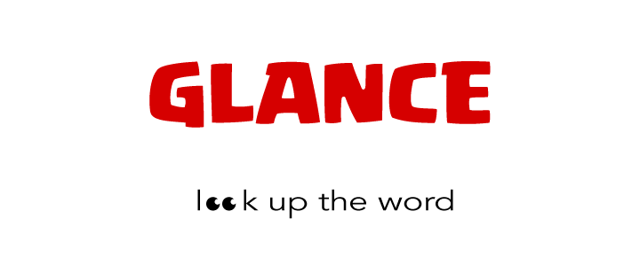
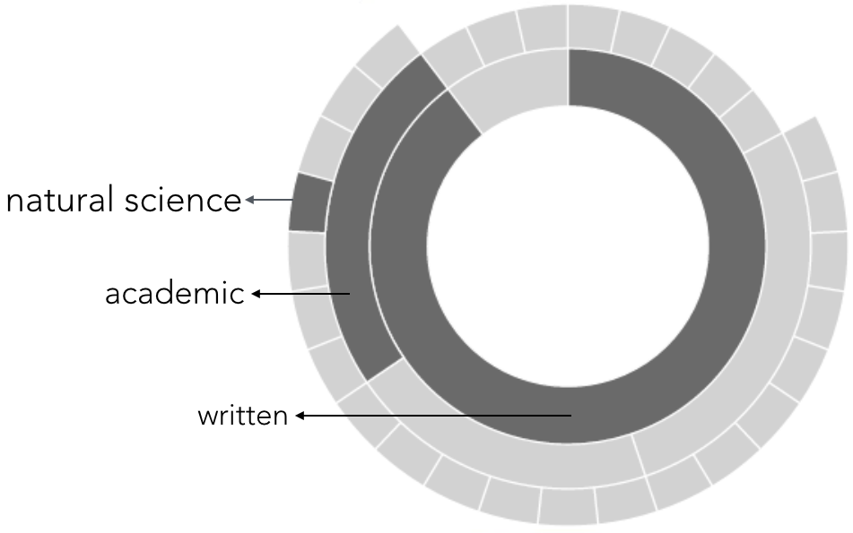
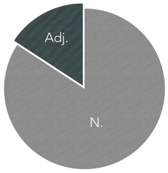

---

glance
======

* ### To-do list

    做完請直接用 `~~to-do blah~~` : ~~to-do blah~~ 加上刪除線

    ####1. displine
    * 加上標籤
    * 中間放百分比
    
    
    
    ####1. POS tag
    * 浮出
    
    
    
    ####1. one-column
    
    ####1. position
    * x 軸 value 不對
    * 改標籤
    * 改顏色（移過去換色?）
    
    

    ####1. polarity
    1. 換顏色
    1. 改標籤位置
    
    ####1. responsive layout
    1. 大螢幕要設定 max-width or 給固定長度
    1. 現在平板會爆炸
    
    
    ####1. 前端
    1. auto-complete
    1. (進階版) visualize auto-completion (cloud?)
    
    ####1. 後端
    1. 解決 heroku 啟動時的 delay 問題
    1. 將一部分資料搬到 mongo lab (控制 500 MB 以下)
    
    

---

### system

所有前端的檔案都放在`/app/`
下面的相對位置都是以/app為根目錄標示的

* flask template: `template/`
* flask statistic file `statistic/`

# /template/index.html
最小單位的區塊長這樣
其中`col-lg-12`代表在大螢幕裝置上這個區塊的寬度就是12個單位, 以glance來說就是單欄顯示
最裡面的div就是裝每個module的地方, 可以用底下的`loadTemplate`把資料裝進去

```html
    <div class="row marketing plot-module">
        <div class="col-lg-12">
            <h4>Definition</h4>
            <div id="wordDefinition">

            </div>

        </div>
    </div>
```


# /scripts/main.js

所有的js檔都先放在這裡面

## Functions

### fetchData( qWord )

user輸入一個字之後, 會啟動這隻function
所以只要把你寫好的function在這隻call就好了


### loadTemplate( templateName, data, entry )

這個檔案會讀取template檔(語法是用鬍子先生mustache, 底層是handlebar), 然後把render好的html檔讀到entry裡面

**template path**
    
記得要把template擺在

    /hb-tempate/<template name>    

並且副檔名是`.tpl`
templateName這個參數就是傳`.tpl`之前的檔案名稱(不包括副檔名)
    
鬍子先生的語法可以參考

[handlebar.js](http://handlebarsjs.com/)


---

* ### to do list
    
    * ##### re-arrange grid
    
        * issue: 現在螢幕縮小之後，右邊那塊會出現捲軸..
        
        1. 重新用 bootstrap 刻好
        2. 直接把右邊那塊釘死
    
    * ##### add loading icon
        1. 發送 ajax 之後再每個區塊加 loading
        2. 全部放一個 loading 就好
    
    * ##### hello page
        1. 要一次 show 出全部？
        2. 先全部隱藏
    
    * ##### N, V 並排
        1. 改變呈現方式
        2. 直接把 V -> Verb, N -> Noun
        
    * ##### POS 大餅圖
        1. 顏色要改 (葛蘭斯配色，要找協調色
        2. 可點選 + highlight 的圖例？
    
    


> Written with [StackEdit](https://stackedit.io/).

